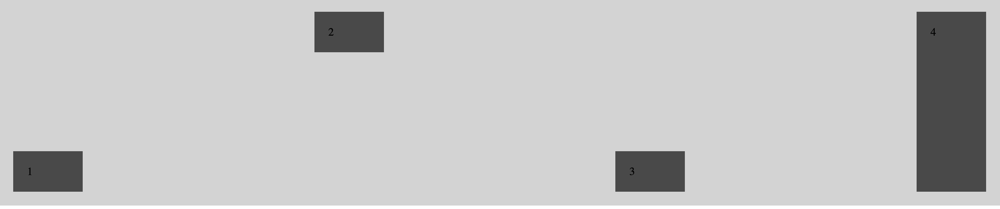
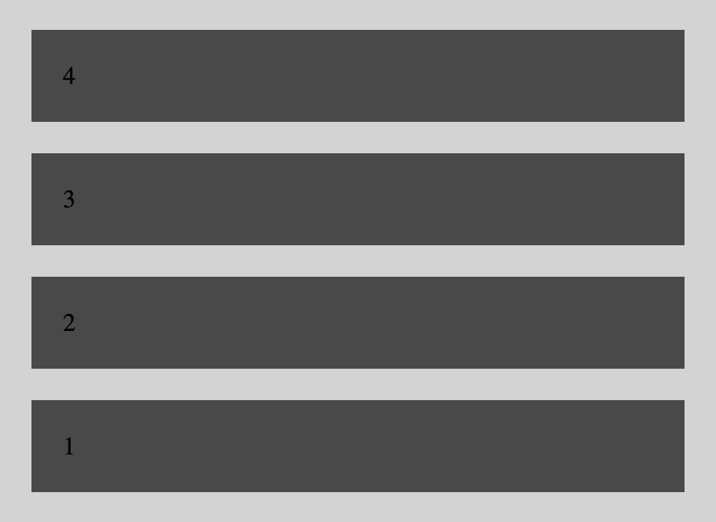
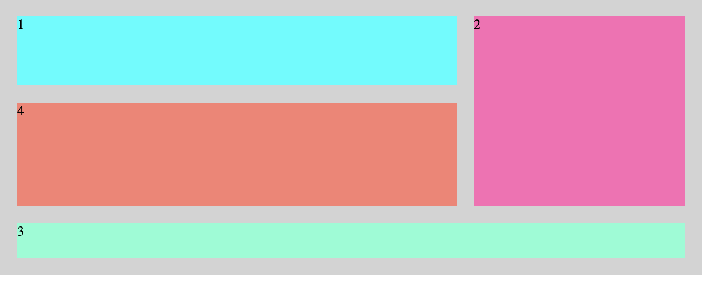

# Lenguajes de marcas: Recuperación 2ª Evaluación

## Instrucciones

- Clonar el repositorio.
- Sin modificar el HTML y el CSS existente, completar los archivos CSS para que cada ejercicio se vea correctamente.

## Ejercicios

### 1. Flexbox (5puntos)

Sin modificar el HTML y el CSS, hacer que los elementos se vean de la siguiente manera por defecto:

Para dispositivos menores de 600px, hacer que se vea de la siguiente manera:

### 2. Grid (5puntos)

Sin modificar el HTML y el CSS, hacer que los elementos se vean de la siguiente manera:

Hay 3 columnas iguales y 3 filas, la 1ª es el doble de altas que la última, y la 2ª el triple de alta que la última
